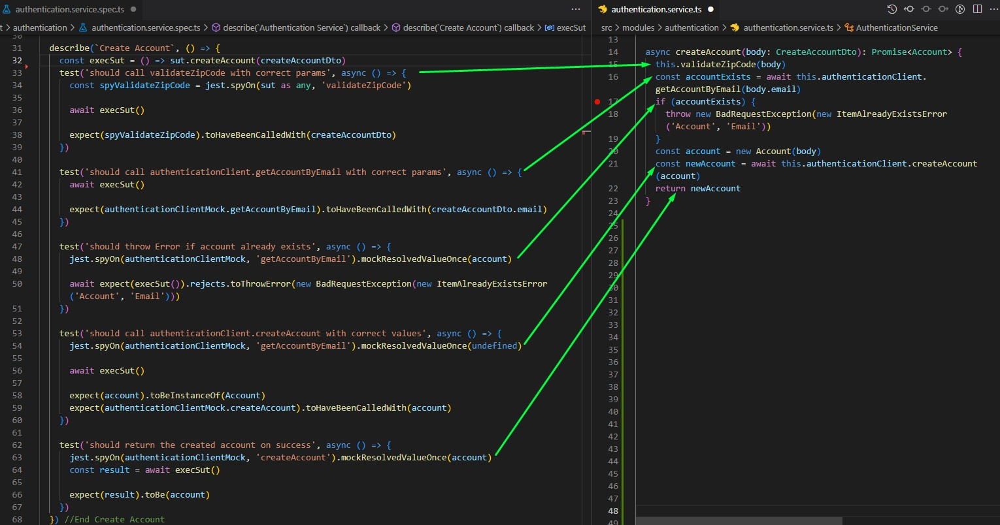
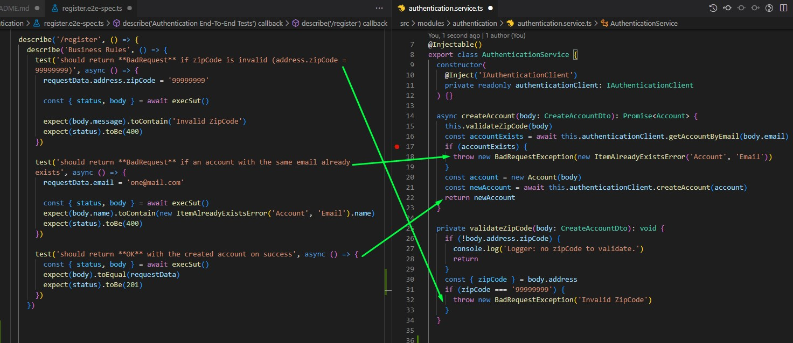

# Backend Testing - NodeJS/NestJS APIs

# Objectives

The main objective of this project is to be kept as a knowledge base about backend testing, including tips and test examples, covering the majority of the most common use cases with unit, integration, and end-to-end tests.

<br>

**NOTES** - This repository was refactored (10 Jan 2023) to add more complexity to the tests and to serve as backend to the Cypress tests repository. If you need unit tests, check an older version for it (before 1 Dez 2022. I will add new unit tests when i have time)

In the refactor i've added an AuthenticationGuard to the UsersController, forcing the consumer to be authenticated to retrieve the users data. The end-to-end tests in this api now have files called usecases (AuthenticationUsecases and UsersUsecases). These usecases are like lego pieces that can be assembled to create multiple test scenarios with ease.

<br>

```
export const authenticatedUserData = makeSignupRequestData()
export let loginResult: LoginResultDto = undefined

export const userSignup = async (requestData?: any) => {
  const data = requestData ?? authenticatedUserData
  return await request(server).post('/signup').send(data)
}

export const userLogin = async (requestData?: any) => {
  const data = requestData ?? { email: authenticatedUserData.email, password: authenticatedUserData.password }
  return await request(server).post('/login').send(data)
}

// Used for any test that requires a registered and logged in user to work
export const setupAuthenticatedTestData = async () => {
  await initServer()
  await userSignup()
  const login = await userLogin()
  loginResult = login.body
  await app.close()
}

```


And this setup can be used as follows


```
describe('Authentication End-To-End Tests', () => {
  beforeEach(async () => {
    await setupAuthenticatedTestData()
  })

```

</br>

**Application**

The application is an authentication API with studies purpose only, where you call a third party authentication service (scr/infrastructure/AuthenticationClient). A fake service was made for the authentication client using an Array of Objects. This app has an authentication route (/signup), where a new account can be created, a login route (/login) and two routes, one to retrieve all accounts (/users) and one to retrieve a single account (/users/:id). 


## Structure

- NestJs backend using Typescript
- Jest as the main testing framework
- @faker-js/faker to generate random data

Test files:

- files .spec.ts: unit tests
- files .test.ts: integration tests
- files .e2e-spec.ts: end to end tests

### Setup

1. clone the git repository
1. run npm install

### To run the tests

1. open the terminal and run the command of the chosen test type

- `npm run test` - to run all tests
- `npm run test:unit` - unit tests
- `npm run test:int`  - integration tests
- `npm run test:e2e`  - end to end tests


###  To reach the endpoints:

1. If youre using vsCode, install the extension REST Client : https://marketplace.visualstudio.com/items?itemName=humao.rest-client
1. go to ``src/modules/authentication/presentation/authentication.http`` and send the requests
1. You must create an account and log into the system to make requests in the users module.
    - ``src/modules/users/presentation/users.http`` 

```
POST http://localhost:3003/signup
content-type: application/json

{
    "name": "Test name",
    "email": "email@email.com",
    "password": "12345",    
    "zipCode": "99999991"    
}

```

</br>


# Tests

Some concepts and tips to have in mind when writing tests:

- Validate only one scenario per test: minimize the number of asserts
- Tests should be Stateless: all elements in a test should return to the initial state after each test.

</br>

**Arrange > Act > Assert**
- Arrange – setup the test required elements (variables, objects, databases, mocks, spies, etc)
- Act – perform the action that will generate the behavior that will be tested
- Assert – verify the result of the action

</br>

**F.I.R.S.T**
- **F**ast - test should be fast. When tests run slow, you won’t want to run them frequently.
- **I**ndependent - Tests should not depend on each other. Tests should be able to run in any order.
- **R**epeatable - Tests should be repeatable in any environment. If your test aren’t repeatable in any environment, then you’ll always have an excuse for why they fail.
- **S**elf-Validating - Tests should have a boolean output. You should not have to read through a log file to tell whether the tests pass.
- **T**imely - Tests need to be written in a timely fashion. Unit test should be written just before the production code. If you write tests after the production code, then you may find the production code to be hard to test

</br>

Have fun making tests :sunglasses:

## Unit Tests

Unit tests are focused on testing the logic path inside a code unit. This unit is usually a method. Tests should have none or just a few external dependencies. Most dependencies can be simulated through mocks. 

If the test has too many dependencies, then an integration test may be better.

Some tips:

1. Check if the test covers all the logic of the method. Most tests should fail if you implement any change of logic inside the tested code, allowing the code to be refactored with fewer chances of creating bugs.
2. It's not necessary to always mock everything. If creating the mock demands too much effort and time, then it might be better to use the functionality directly.
3. It's not necessary to create unit tests for all external dependencies. If you don't trust them, then you shouldn't be using them.
4. The % percentage of coverage should not be the sole reference guiding a test strategy. Real code coverage will only be reached if item 1 from this list is followed.

Unit test example:

In this example, if you change the logic or comment any block of code, the related tests will fail.



</br>

## Integration Tests

Integration tests are very similar to unit tests, but they use the real implementation of the dependencies instead of mocks. They are important because the implementation of a software can change, containing breaking changes. If you mock everything, your tests wont fail and the bug might escape to production.

Some examples of integration tests:

- Test a repository + database interaction
- Test a call to a external service


</br>

## End-To-End Tests (e2e)

End-to-end tests are focused in testing a entire process flow.

In APIs, that consist in making a request and getting the expected response depending in the usecase tested.

E2E tests should cover all business rules and all validations. The business rules are usually located in the usecases (services) or command handlers, while the validations may be found the controllers and sometimes inside a domain entity. Its wise to test / pay attention to every **return** , **throw** inside those files.

Example:

